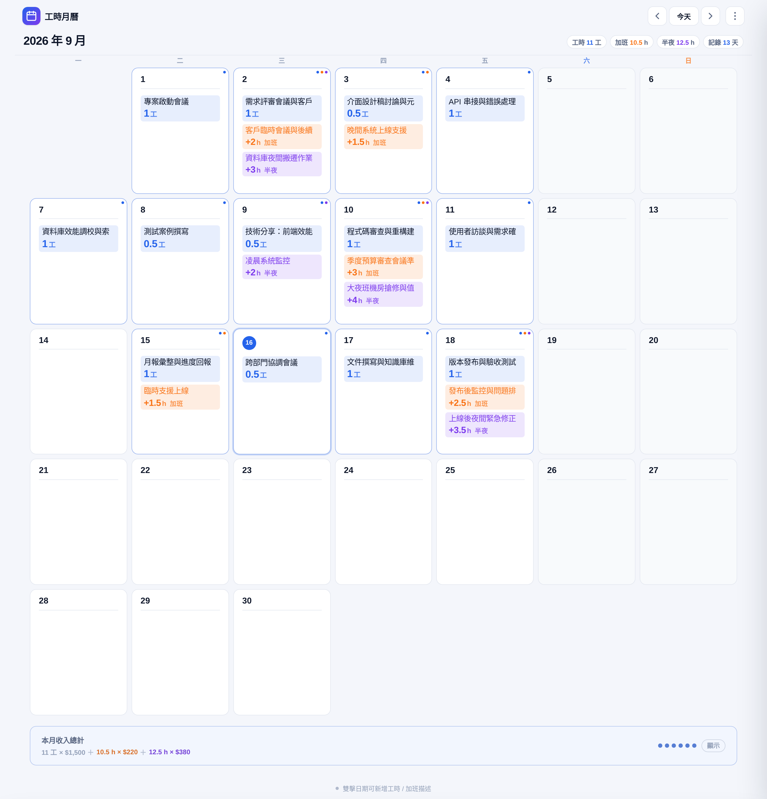
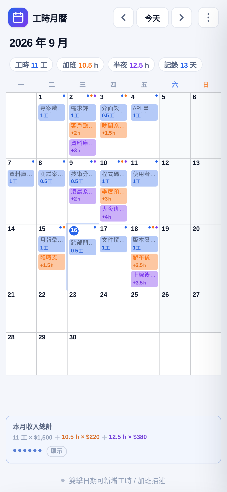
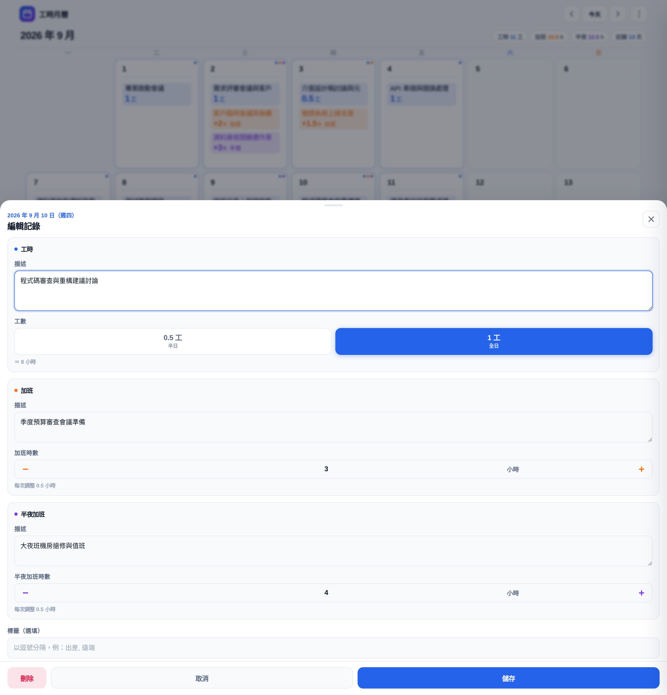
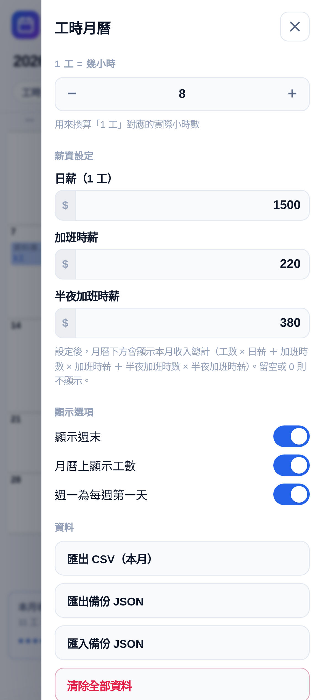

# 工時月曆 · Worktime Calendar

以月曆為核心的工時與加班記錄 PWA。**雙擊日期即可新增工時描述與加班描述**，資料存在本機、離線可用、可安裝到主畫面。

 

**線上使用** → https://valtalab.github.io/worktime-calendar/

| 月曆主介面（桌機） | 月曆主介面（手機） |
| --- | --- |
|  |  |
|  |  |

---

## 功能

| 功能 | 說明 |
| --- | --- |
| **月曆主介面** | 一眼看清整月工時分布，有記錄的日期自動標示 |
| **雙擊新增** | 雙擊任一日期 → 填寫工時描述、工數、加班描述、加班時數、半夜加班描述與時數 |
| **工數二選一** | 正常工數只提供 **0.5 工（半日）** 與 **1 工（全日）** 兩個選項 |
| **加班以小時計** | 加班、半夜加班時數皆以 **0.5 小時** 為單位遞進 |
| **工時、加班、半夜分組** | 月曆上工數、加班時數、半夜加班時數各佔一個色塊，不並排 |
| **描述優先** | 格子內先顯示描述，時數緊接在下方 |
| **一組一色塊** | 每格分成三組：**工時描述＋工數**、**加班描述＋加班時數**、**半夜加班描述＋半夜加班時數**。每組是一個獨立色塊（藍／橘／紫），描述與數字上下排列但**共用同一個底色框**，誰對應誰一目了然 |
| **三描述同時顯示** | 同一天可同時顯示**工時描述**（黑字）、**加班描述**（橘字）、**半夜加班描述**（紫字），彼此不會互相蓋掉 |
| **滿版版面** | 版面用滿螢幕左右兩側（桌機僅留 20–28px 邊距），格子越寬工數／加班色塊越大 |
| **月度統計** | 月工數、月加班時數、月半夜加班時數（有半夜紀錄時才顯示）、記錄天數 |
| **收入總計** | 設定日薪、加班時薪、半夜加班時薪後，月曆下方自動計算本月收入（工數 × 日薪 ＋ 加班時數 × 加班時薪 ＋ 半夜加班時數 × 半夜加班時薪）；金額預設遮蔽，點一下才顯示 |
| **快捷操作** | 觸控裝置單擊即開；`←/→` 切換月份、`T` 回到本月、`⌘/Ctrl+Enter` 儲存 |
| **離線可用** | Service Worker 快取，無網路也能開；資料存在瀏覽器 |
| **自動檢測更新** | 開啟或回到前景時自動比對版本，有新版本彈出提示並可**一鍵更新** |
| **可安裝** | 完整 Web App Manifest，加到主畫面後如原生 App |
| **深色模式** | 跟隨系統自動切換 |
| **資料匯出** | 匯出 CSV（工數 + 加班小時 + 半夜加班小時）、匯出／匯入 JSON 備份 |

---

## 單位說明

本應用有兩種計量單位，各有分工：

| 項目 | 單位 | 選項 |
| --- | --- | --- |
| **正常工時** | 工 | `0.5 工`（半日）、`1 工`（全日） |
| **加班** | 小時 | `−` / `+` 每次 0.5 小時，0 至 24 小時 |
| **半夜加班** | 小時 | `−` / `+` 每次 0.5 小時，0 至 24 小時 |

**1 工 = 標準工時**，預設 8 小時（可在選單調整）。選好工數後，面板下方會即時顯示「＝ N 小時」換算。

> **舊資料自動遷移**：不論你之前用過哪一版，開啟後都會自動轉換，無需手動處理。
> - 舊版以小時記錄工時 → 依 1 工 = 8 小時換算為工數
> - 舊版以「工」記錄加班 → 換算回小時

---

## 收入總計

月曆下方會顯示當月收入。點右上角 `⋮` → **薪資設定** 先填三個數字：

| 設定項 | 說明 |
| --- | --- |
| **日薪（1 工）** | 做滿 1 工對應的金額，例如 1500 |
| **加班時薪** | 每小時加班對應的金額，例如 220 |
| **半夜加班時薪** | 每小時半夜加班對應的金額，例如 380 |

計算方式：

> **本月收入 ＝ 月工數 × 日薪 ＋ 月加班時數 × 加班時薪 ＋ 月半夜加班時數 × 半夜加班時薪**

以 8 工、9 小時加班、6 小時半夜加班，日薪 $1,500、加班時薪 $220、半夜加班時薪 $380 為例：

```
8 工 × $1,500 ＋ 9 h × $220 ＋ 6 h × $380
＝ $12,000 ＋ $1,980 ＋ $2,280 ＝ $16,260
```

**顯示規則**

- **金額預設遮蔽**為 `••••••`，**點一下才顯示**；再點一下可收回
  （避免在旁人面前直接暴露收入）。顯示／隱藏狀態會被記住，
  換月、重新載入都不會自己彈開
- 三個欄位**都留空或為 0** → 完全不顯示收入區塊，版面維持原樣
- **只填其中一部分** → 只計算已填的項目，計算式也只顯示那些項目
  （例如只設日薪，就不會出現「0 h × $0」這種沒意義的片段）
- 金額自動加上**千分位**；有小數時才顯示到兩位（例如 `$13,980`、`$13,980.50`）
- 切換月份時同步重算，顯示的永遠是**當前檢視月份**的收入
- 薪資設定會跟著 JSON 備份一起匯出／匯入

---

## 快速開始

### 本機執行

因為使用 Service Worker，**不能用 `file://` 直接開啟**，需要一個靜態伺服器：

```bash
cd worktime-calendar

# Python（內建）
python3 -m http.server 8099

# 或 Node
npx http-server -p 8099
```

開啟 <http://localhost:8099>

### 部署

純靜態檔案，**不需要建置步驟**，推到任何靜態託管都能跑：

```bash
# GitHub Pages：把檔案放到 repo 根目錄或 /docs，於 Settings → Pages 選擇分支即可
# Netlify / Vercel / Cloudflare Pages：直接連動 repo，build command 留空，
# publish directory 指向本專案資料夾
```

專案已內含 GitHub Actions 工作流（`.github/workflows/pages.yml`），
若要在 GitHub Pages 自動部署，於 repo 的 **Settings → Pages → Source** 選擇 **GitHub Actions** 即可。

---

## 版面與響應式設計

版面**用滿螢幕左右兩側**（不再置中於 860px 窄欄），螢幕越寬每格能顯示的工數／加班資訊越醒目。

**手機版（≤ 480px）採用「網格線分隔」風格**，而非一日一卡片 —— 7 欄在窄螢幕上分攤後，
卡片的邊框、圓角與間隙會吃掉約 20% 寬度。改用細格線分隔後，390px 螢幕上每格內容寬度由
38px 提升至 46px。

| 斷點 | 風格 | 左右邊距 | 格子寬（1600px 時） | 工數字級 | 每則描述行數 | 列高下限 |
| --- | --- | --- | --- | --- | --- | --- |
| ≤ 480px | **網格線** | 10px | 52px | 9px | 1 | 由內容決定 |
| ≥ 700px | 卡片 | 28px | 89px | 14px | 2 | 190px |
| ≥ 1000px | 卡片 | 40px | 126px | 18px | 2 | 210px |
| ≥ 1400px | 卡片 | 56px | 177px | 19px | 2 | 230px |

> **列高下限的取捨**：列高下限已改為「放得下三組描述＋三個色塊」的可讀值
> （190 / 210 / 230px），空間不足時**讓頁面垂直滾動**，而不是壓縮或隱藏內容。
> 依重要性排序的取捨原則是：**描述一定要看得見 > 三個色塊數字要完整 > 不用滾動**。

### 格子內容結構

每一格最多分成**三組**，每組是一個**單一色塊**，描述與數字都在色塊裡面（描述在上、數字在下）：

```
.day-groups
 ├─ .day-group.work-group    工時組（藍色塊）
 │   ├─ .day-desc             工時描述（黑字）
 │   └─ .day-units            工數「1工」（藍字）
 ├─ .day-group.ot-group      加班組（橘色塊）
 │   ├─ .day-desc.ot-text     加班描述（橘字）
 │   └─ .day-units.ot-units   「+3h 加班」（橘字）
 └─ .day-group.night-group   半夜加班組（紫色塊）
     ├─ .day-desc.night-text   半夜加班描述（紫字）
     └─ .day-units.night-units「+2h 半夜」（紫字）
```

**色塊（底色＋圓角＋內距）掛在 `.day-group` 上**，不是掛在 `.day-units` 上——
描述與數字共用同一個底色框，一眼就能看出「這個描述對應這個數字」。
色塊內兩行都靠左對齊（`justify-content: flex-start`），左緣切齊，
不會一左一中斷成兩個獨立元素。

沒有內容的組不會產生（例如沒填加班就只有工時一組、只填半夜就只有半夜一組）。
`.day-groups` 用 `margin-top: 6px` **緊接在日期下方**（不再貼底）；
組內 `gap` 小、組間 `gap` 大，讓三組資料在視覺上分得開。
角落另有對應色點（`.badge-dot` / `.badge-dot.ot` / `.badge-dot.night`）。

> **為什麼不貼底對齊**：色塊若用 `margin-top: auto` 貼底，
> 「只有一天資料」和「有三天資料」的格子色塊會落在不同高度，
> 整排看過去高低起伏、無法逐列比較。改為緊接日期下方後，
> 同一列的色塊從同一條水平線開始，第三組有沒有出現一眼可見。

**列高的估算基準**：一個格子最擠的情況是「工時描述 2 行 + 加班描述 2 行 + 半夜描述 2 行
+ 三個色塊 + 兩段組間距」。列高下限必須放得下這個最擠情境，
否則 `.day` 的 `overflow: hidden` 會把下面的色塊裁掉。

> 改動字級、行高、色塊 padding 或**組間距**時，**記得重新量測這個最擠情境**，
> 否則很容易又出現「描述多一點就被切掉」的問題。

> **窄螢幕（≤ 480px）** 空間不足，隱藏「加班」／「半夜」文字標籤，
> 改以橘色、紫色色塊本身辨識；描述限 1 行，確保數字（第二行）一定放得下。

---

## 檔案結構

```
worktime-calendar/
├── index.html                 # 主介面（月曆 + 編輯面板 + 選單）
├── styles.css                 # 樣式：響應式、深色模式
├── app.js                     # 邏輯：月曆渲染、儲存、匯出匯入
├── sw.js                      # Service Worker（離線快取 + 更新偵測）
├── version.json               # 目前版本（更新偵測的權威來源）
├── manifest.webmanifest       # PWA 資訊清單
├── bump-version.sh            # 升版工具：同步更新 version.json / sw.js / app.js
├── build-standalone.sh        # 打包單檔版（CSS/JS/圖示全部內嵌）
├── push-api.sh                # 用 GitHub Contents API 提交推送
├── screenshots/               # 介面截圖
├── icons/
│   ├── icon-192.png
│   ├── icon-512.png
│   ├── icon-maskable-512.png
│   ├── apple-touch-icon.png
│   └── favicon-32.png
├── .github/workflows/pages.yml
└── README.md
```

---

## 版本與更新

App 會**自動檢查版本**，發現新版時在底部彈出提示，按「立即更新」即可完成，**資料不會遺失**。

### 更新的運作方式

| 時機 | 行為 |
| --- | --- |
| 開啟 App 後 1.5 秒 | 靜默比對 `version.json`，有新版就提示 |
| 切回前景（切換分頁／喚醒） | 重新檢查一次 |
| 每 30 分鐘 | 背景再檢查 |
| 選單 → 「檢查更新」 | 手動檢查，並顯示結果狀態 |
| 按「立即更新」 | 請新版 Service Worker 接管 → 自動重載到最新版 |
| 按「稍後再說」 | 同一個版本不再重複打擾（下次改版仍會提示） |

> **為什麼要看得到版本號？** 選單底部顯示目前版本與建置時間，回報問題時可直接引用。

### 發佈新版本

```bash
# 1) 升版（patch / minor / major，或指定版本號）
bash bump-version.sh minor "這次改了什麼"

# 2) 重新打包單檔版（可選）
bash build-standalone.sh

# 3) 提交推送（GitHub Actions 會自動部署）
GITHUB_TOKEN=<你的 token> bash push-api.sh -m "release: 1.6.0"
```

> **為什麼不是 `git push`？** 本專案的開發沙箱對 `github.com:443` 的 TLS 連線
> 不穩定（會出現 `gnutls_handshake() failed`），改用 `api.github.com` 的 REST API
> 則穩定可靠。`push-api.sh` 會自動偵測有變更的檔案、逐檔上傳 blob、
> 組 tree、建 commit、更新 main 分支。
>
> ```bash
> bash push-api.sh --dry-run   # 先看會提交什麼
> bash push-api.sh --init      # 建立 repo 並啟用 Pages（首次用）
> ```

`bump-version.sh` 會**同步更新三個地方**，避免版本號不一致導致更新偵測失效：

| 檔案 | 更新的內容 |
| --- | --- |
| `version.json` | `version` 與 `build`（更新偵測的比對來源） |
| `sw.js` | `CACHE` 快取名稱（改名才會清掉舊快取） |
| `app.js` | `APP_VERSION` 與 `APP_BUILD`（畫面顯示用） |

---

## 資料儲存

資料儲存在瀏覽器 `localStorage`，**不會上傳到任何伺服器**：

| Key | 內容 |
| --- | --- |
| `worktime-calendar:v1` | 所有工時記錄，格式 `{ "YYYY-MM-DD": { workDesc, workUnits, otDesc, otHours, tags } }` |
| `worktime-calendar:settings:v1` | 偏好設定（1 工 = N 小時、顯示選項） |

> `workUnits` 單位是「工」（0.5 或 1），`otHours` 單位是「小時」。舊格式在載入與匯入時會自動遷移。

> **注意**：清除瀏覽器資料會一併清除記錄，建議定期用「匯出備份 JSON」留存。

### 換裝置 / 換瀏覽器

1. 舊裝置：選單 → **匯出備份 JSON**
2. 新裝置：選單 → **匯入備份 JSON**

---

## 操作說明

| 操作 | 方式 |
| --- | --- |
| 新增／編輯記錄 | **雙擊**日期格（觸控裝置單擊即可） |
| 選擇工數 | 點 `0.5 工`（半日）或 `1 工`（全日） |
| 調整加班時數 | 點 `−` / `+`，每次 0.5 小時 |
| 調整半夜加班時數 | 點「半夜加班」區塊的 `−` / `+`，每次 0.5 小時 |
| 設定薪資 | 右上角 `⋮` → 薪資設定 → 填日薪、加班時薪、半夜加班時薪 |
| 快速儲存 | `⌘/Ctrl + Enter` |
| 關閉面板 | `Esc` 或點擊背景 |
| 切換月份 | 點 `‹` `›`，或按 `←` `→` |
| 回到本月 | 點「今天」，或按 `T` |

---

## 技術要點

- **零依賴**：純 HTML/CSS/JS，無框架、無建置流程，整包約 50 KB
- **離線優先**：Service Worker 採「快取優先、背景更新」策略；導航請求走「網路優先、離線回快取」
- **輸入體驗**：數字欄位 `inputmode="decimal"`，行動端彈出數字鍵盤
- **無障礙**：面板為 `role="dialog"` + `aria-modal`，日期格可 Tab 聚焦並以 `Enter` 開啟，支援 `prefers-reduced-motion`
- **觸控優化**：44px 以上觸控目標、`env(safe-area-inset-*)` 適配瀏海螢幕

---

## 授權

MIT
